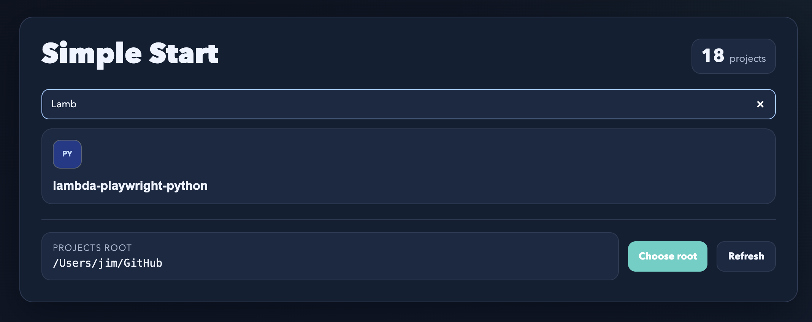

# simple-start

[](https://open-vsx.org/extension/ElectricPants/simple-start)
[](https://marketplace.visualstudio.com/items?itemName=ElectricPants.simple-start)
[](https://github.com/sjw7444/vscode-simple-start/actions/workflows/release.yml)
[](LICENSE)

`simple-start` is a clean startup dashboard for VS Code empty windows.

When you launch VS Code with no folder/workspace open, it can show a fast project picker that:

- lists immediate child folders of a configured root
- shows the best available project icon (with hi-res preference)
- opens the selected project in the current window

## Screenshot



## Install

- Visual Studio Marketplace: <https://marketplace.visualstudio.com/items?itemName=ElectricPants.simple-start>
- Open VSX: <https://open-vsx.org/extension/ElectricPants/simple-start>
- Local `.vsix`: `simple-start-0.0.1.vsix` in this repository root

Including install links keeps onboarding fast and helps users choose the right channel for VS Code, Cursor, and other Open VSX-compatible editors.

## Quick Start

1. Install the extension.
2. Set `Workbench: Startup Editor` to `none`.
3. Run `simple-start: Select Projects Root` and choose your parent projects folder.
4. Open a new empty VS Code window.
5. Pick a project card to open it.

If the page does not open automatically, run `simple-start: Open Start Page`.

## Features

- Startup-aware open behavior for empty windows.
- One-click project open in the current window.
- Search/filter project cards.
- Hi-res icon preference (Apple touch/app icons and larger assets favored over tiny favicons).
- Broad icon discovery for web, iOS, Android, macOS, Electron, Node, and more.
- Configurable shared app icon map for team-wide naming conventions.
- Type-based SVG fallback icon when no file icon exists.

## Commands

- `simple-start: Open Start Page`
- `simple-start: Select Projects Root`
- `simple-start: Refresh Start Page`

## Configuration

- `simpleStart.openOnStartup`
	Opens on startup for empty windows when `workbench.startupEditor` is `none`.
- `simpleStart.projectsRoot`
	Absolute path to the parent folder containing your projects.
- `simpleStart.applicationIconMap`
	Map app names to icon candidate paths relative to each project root.

Example:

```json
"simpleStart.applicationIconMap": {
	"shopper": [
		"assets/icon.png",
		"ios/Runner/Assets.xcassets/AppIcon.appiconset",
		"android/app/src/main/res/mipmap-xxxhdpi/ic_launcher.png"
	],
	"admin": [
		"public/apple-touch-icon.png",
		"public/android-chrome-192x192.png",
		"public/favicon-512x512.png"
	]
}
```

Matching is name-based (`admin-portal` matches `admin`).

## Icon Selection Strategy

`simple-start` prefers higher quality icons first:

1. App-specific paths from `simpleStart.applicationIconMap`.
2. iOS/Android/macOS/Electron conventional app icon locations.
3. `package.json` `icon` field.
4. Generic `*.appiconset` discovery.
5. Ranked website icons (`apple-touch-icon`, `android-chrome-*`, large `192/512` assets).
6. Fallback search for likely icon/logo assets.
7. Generated type-based SVG icon.

Icon paths are cached in-memory per project path for speed and refreshed when root changes or `Refresh Start Page` is used.

## Development

### Prerequisites

- Node.js 20+ (or current LTS)
- npm
- VS Code 1.109+

### Local Workflow

```bash
npm install
npm run compile
npm run lint
```

- Press `F5` to launch the Extension Development Host.
- Use `npm run watch` for incremental rebuilds.

### Tests

```bash
npm test
```

## Packaging And Publishing

```bash
npm run package:vsix
```

Publish scripts:

- `npm run publish:vsce`
- `npm run publish:ovsx`

Required secrets for CI release workflow:

- `VSCE_PAT`
- `OVSX_PAT`

## Compatibility

- VS Code: full support
- Cursor / VS Code-compatible editors: install via Open VSX or `.vsix`

## Troubleshooting

- Start page not opening:
	Set `workbench.startupEditor` to `none` and ensure no folder/workspace is open.
- Wrong or blurry icon:
	Run `simple-start: Refresh Start Page` to clear icon cache and re-rank candidates.
- No projects listed:
	Re-check `simpleStart.projectsRoot` and ensure it points to a directory with child folders.

## Contributing

Please read `CONTRIBUTING.md` for setup, workflow, testing expectations, and PR guidance.

Community standards are in `CODE_OF_CONDUCT.md`.

## Security

See `SECURITY.md` for private vulnerability reporting instructions.

## License

MIT. See `LICENSE`.
